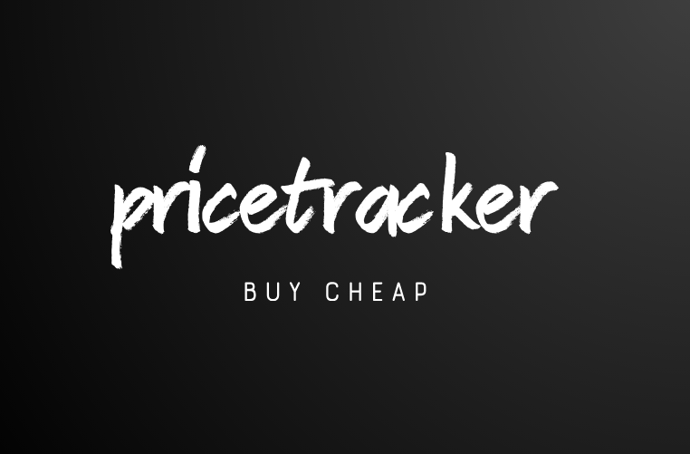

  

<h3 align="center">pricetracker</h3>

---

 Web App to Track Products in Amazon
      

## 📝 Table of Contents

- [📝 Table of Contents](#-table-of-contents)
- [🧐 About ](#-about-)
- [🏁 Getting Started ](#-getting-started-)
- [⛏️ Built Using ](#️-built-using-)
- [✍️ Authors ](#️-authors-)

## 🧐 About 

This is a Next Js based project where we can track products from Amazon. Tracked items also stores pricing history.

## 🏁 Getting Started 

## ⛏️ Built Using 

- [MongoDB](https://www.mongodb.com/) - Database
- [Express](https://expressjs.com/) - Server Framework
- [VueJs](https://vuejs.org/) - Web Framework
- [NodeJs](https://nodejs.org/en/) - Server Environment

## ✍️ Authors 

- [@Riddhick](https://github.com/Riddhick) - Idea & Initial work

See also the list of [contributors](https://github.com/kylelobo/The-Documentation-Compendium/contributors) who participated in this project.

